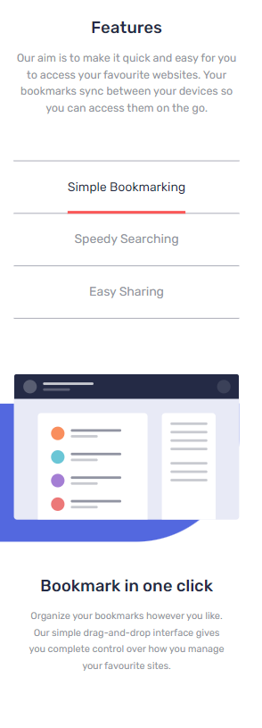

# Frontend Mentor - Bookmark landing page solution

This is a solution to the [Bookmark landing page challenge on Frontend Mentor](https://www.frontendmentor.io/challenges/bookmark-landing-page-5d0b588a9edda32581d29158). Frontend Mentor challenges help you improve your coding skills by building realistic projects. 

## Table of contents

- [Overview](#overview)
  - [The challenge](#the-challenge)
  - [Screenshots](#screenshots)
  - [Links](#links)
- [My process](#my-process)
  - [Built with](#built-with)
- [Author](#author)

## Overview

### The challenge

Users should be able to:

- View the optimal layout for the site depending on their device's screen size
- See hover states for all interactive elements on the page
- Receive an error message when the newsletter form is submitted if:
  - The input field is empty
  - The email address is not formatted correctly

### Screenshots

### Links

- Solution URL: [https://github.com/DaniNewAcc/bookmark-landing-page](https://github.com/DaniNewAcc/bookmark-landing-page)
- Live Site URL: [https://daninewacc.github.io/bookmark-landing-page/](https://daninewacc.github.io/bookmark-landing-page/)

## My process

### Built with

- Mobile-first workflow
- Semantic HTML5 markup
- CSS custom properties
- TailwindCSS
- Tailwind Merge
- CLSX
- Class Variance Authority
- Framer Motion
- Typescript 
- [React](https://reactjs.org/) - JS library
- [Vite](https://vitejs.dev/)

## Author

- Frontend Mentor - [@DaniNewAcc](https://www.frontendmentor.io/profile/DaniNewAcc)

